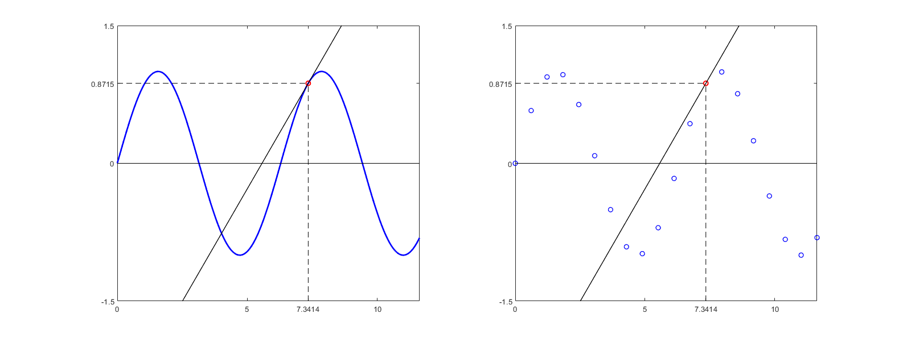

## 여는 글

​	함수나 데이터의 기울기 혹은 변화도를 알고 싶을 때 <u>미분</u>(Differenciation)을 사용합니다.  정규과정을 이수했다면 고등학교 수학시간 때 미분의 정의와 규칙에 대해 배운적이 있을텐데요,  주요 내용은 미분의 정의, 대표 함수들의 미분 및 연쇄 법칙에 관한 것이다.  예를 들면,  $$\sin(\sin(x))\  \acute{\rightarrow}\ \cos(\sin(x))\cdot\cos(x)$$ 와 같은 규칙이 존재하며 이는 미분의 정의, 연쇄 법칙 등에 의해서 구할 수 있습니다.

​	컴퓨터에서 미분을 하기 위해서는 조금 다른 방법이 필요하다. 마치 우리가 함수들에 대해서 미분하는 법을 배우고 익혔듯이 컴퓨터에게도 같은 내용을 알려주거나(부호적 방법=심볼릭), 약간의 오차를 허용하고 근사적으로 아는 방법(수치 미분)이 있다. 정리하면 다음과 같다.  

* 함수를 정확히 알고 있을 때  (예: $$f(x)=\sin(x)$$)
  * 부호 미분 (심볼릭 미분, Symbolic differentiation)  
  * 수치 미분  (Numerical differentiation)
  * 최적화 (Optimization)
* 몇 개의 함수 값만을 알고 있을 때   (예: $$f(x_1), f(x_2), \cdots, f(x_N)$$)
  * 수치 미분  

​	예를 들면 아래와 같이 왼쪽 함수 $$f(x)=\sin(x)$$와 오른쪽의 몇 개의 함수값이 있다고 해보자. 왼쪽과 같이 함수를 정확하게 알고 있는 경우, 심볼릭 미분이나 최적화 방법을 통해서 빨간 점에서의 기울기를 정확하게 구할 수 있다. 하지만 오른쪽과 같이 데이터가 이산적으로 주어져 있는 경우, 빨간 점에서의 기울기를 알아낼 수 있는 방법이 다소 직관적이지 않다.

이번 포스트에서는 이산 데이터에서 (약간의 에러가 섞인) 미분값을 구할 수 있는 방법들에 대해서 알아본다.

#### 참고

* 매스매티카(Mathematica)나 매트랩(MATLAB), 울프람알파(WolframAlpha) 등의 상용 프로그램에서 심볼릭 미분을 지원하나, 해당 프로그램들은 비싸기 때문에 학교 외에서는 사용하기  곤란한 감이 있다. 무료 소프트웨어인 옥타브(octave)에서 심볼릭 연산을 지원하긴 한다.  

* 추가적으로 [수치 해석] 포스트에서는 다루지 않겠지만, 잡음(노이즈, noise)이 포함된 데이터의 경우 사용하는 방법이 완전히 달라진다. 이는 노이즈로 인한 함수 값의 변화가 결과에 영향을 주기 때문이다.  특히 수치 미분은 고주파 노이즈에 아주 취약한 모습을 보인다. 노이즈의 영향을 완화시키고자 여러 방법이 연구되고 있지만, 주로 미분을 해야 하는 상황을 피해서 돌아가는 방법을 선호한다.

## 이론

정리하면 아래 표와 같은 방법들이 있다.

| 방법               | 그림 예시 | 정확도 |      |
| ------------------ | --------- | ------ | ---- |
| Forward Difference |           |        |      |

정확도(accuracy)는 해당 방법의 오차가 간격 $$\Delta h$$에 얼만큼 영향을 받는지를 나타낸 것이다. 

